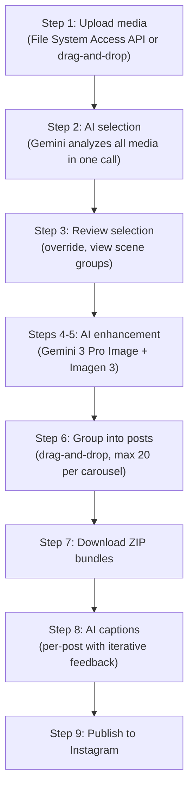
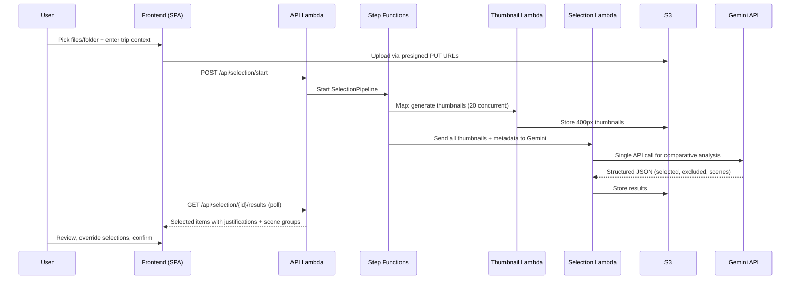

# Media Selection

AI-powered selection of the best photos and videos for Instagram carousel posts.

## What is Media Selection?

Media selection takes a batch of photos and videos and uses Google's Gemini API to pick the best subset for an Instagram carousel post. It uses a **quality-agnostic** approach — photo quality is NOT a selection criterion because users can enhance photos afterwards. Instead, the AI prioritizes subject diversity, scene representation, and media type synergy.

Available as a CLI tool (`media-select`) and the cloud-hosted pipeline (`media-lambda`).

## Workflow

The cloud pipeline is a multi-step process where the user controls the pace between steps:

## How It Works

## Selection Criteria

The AI selects using **quality-agnostic, subject-diversity-first** criteria (see [DDR-016](./design-decisions/DDR-016-quality-agnostic-photo-selection.md)):

1. **Subject/scene diversity** (highest) — food, architecture, landscape, people, activities
2. **Scene representation** — ensure each sub-event/location is covered
3. **Media type synergy** — choose whether a moment is better as photo or video
4. **Audio content** — consider music, speech, ambient sounds in videos
5. **Enhancement potential** (duplicates only) — for duplicates, pick easiest to enhance

**Scene detection** uses a hybrid approach: visual similarity + time gaps (2+ hours) + GPS gaps (1+ km).

## Mixed Media

Photos and videos compete equally in selection — a compelling 15-second video may be chosen over multiple similar photos. See [DDR-020](./design-decisions/DDR-020-mixed-media-selection.md).

## Post Grouping and Captions

After selection and enhancement, media is grouped into Instagram carousel posts (max 20 items each). Each group gets an AI-generated caption with hashtags, location tag, and an iterative feedback loop ("make it shorter", "more casual"). See [DDR-033](./design-decisions/DDR-033-post-grouping-ui.md) and [DDR-036](./design-decisions/DDR-036-ai-post-description.md).

## Download

Post groups are bundled as ZIP files. Images are combined into one ZIP; videos are split into bundles of 375 MB or less. See [DDR-034](./design-decisions/DDR-034-download-zip-bundling.md).

## Related DDRs

- [DDR-014](./design-decisions/DDR-014-thumbnail-selection-strategy.md) — Thumbnail-based selection strategy
- [DDR-016](./design-decisions/DDR-016-quality-agnostic-photo-selection.md) — Quality-agnostic selection criteria
- [DDR-020](./design-decisions/DDR-020-mixed-media-selection.md) — Mixed media (photos + videos) selection
- [DDR-029](./design-decisions/DDR-029-file-system-access-api-upload.md) — File System Access API upload
- [DDR-030](./design-decisions/DDR-030-cloud-selection-backend.md) — Cloud selection backend
- [DDR-033](./design-decisions/DDR-033-post-grouping-ui.md) — Post grouping UI
- [DDR-034](./design-decisions/DDR-034-download-zip-bundling.md) — Download ZIP bundling
- [DDR-036](./design-decisions/DDR-036-ai-post-description.md) — AI post description generation
- [DDR-037](./design-decisions/DDR-037-step-navigation-and-state-invalidation.md) — Step navigation and state invalidation

---

**Last Updated**: 2026-02-09
