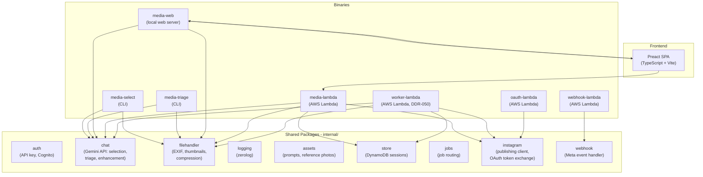
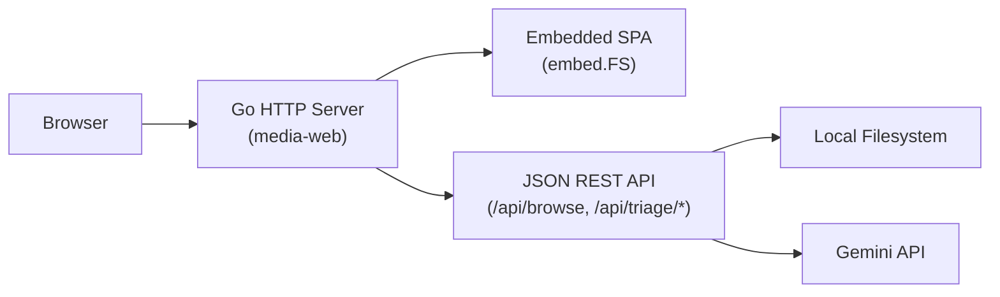
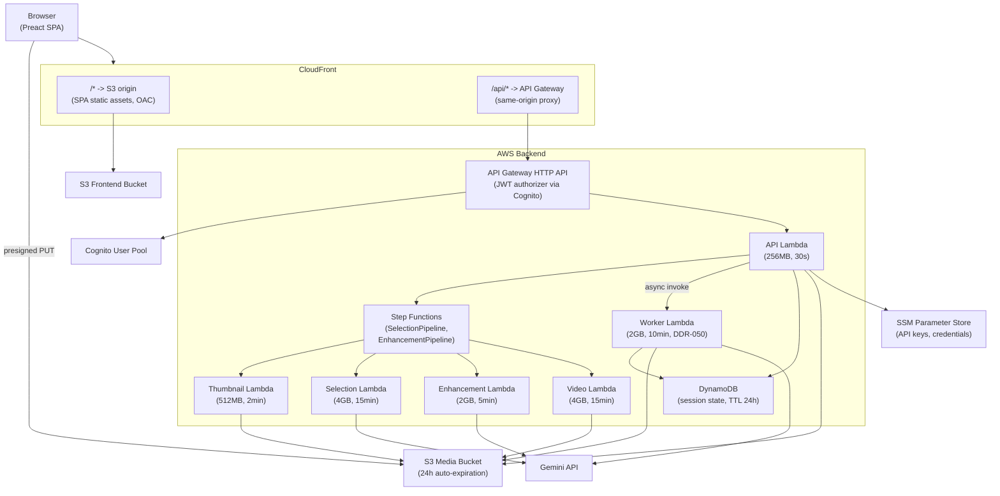
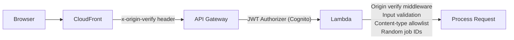

# Architecture Overview

## System Overview

The Gemini Media CLI is a collection of Go tools for analyzing, selecting, and enhancing photos and videos using Google's Gemini API. It runs in two modes: **local** (CLI + embedded web server) and **cloud** (AWS Lambda + S3 + CloudFront).



## Tech Stack

| Component | Technology |
|-----------|-----------|
| Language | Go 1.24 |
| AI Model | Gemini 3 (Flash for triage, Pro for selection/enhancement) |
| SDK | `google.golang.org/genai` |
| CLI Framework | `github.com/spf13/cobra` |
| Logging | `github.com/rs/zerolog` |
| Web Frontend | Preact 10 + Vite 6 + TypeScript |
| AWS SDK | `aws-sdk-go-v2` (S3, SSM, DynamoDB) |
| Lambda Adapter | `aws-lambda-go-api-proxy` (HTTP API v2 to `http.ServeMux`) |

## Local Architecture

In local mode, `media-web` serves the Preact SPA via `go:embed` and exposes a JSON REST API on `localhost:8080`. Media files are read from the local filesystem.



The JSON-only API design enabled the Phase 2 migration to Lambda without changing the frontend. See [DDR-022](./design-decisions/DDR-022-web-ui-preact-spa.md).

## Cloud Architecture

In cloud mode, the Preact SPA is hosted on CloudFront (S3 origin), the Go backend runs as Lambda functions behind API Gateway, and media files are stored in S3 with presigned URL uploads.



### Key Design Decisions

1. **Presigned URL uploads** — browser uploads directly to S3, bypassing Lambda's 6MB payload limit
2. **CloudFront API proxy** — `/api/*` requests are proxied to API Gateway, making all requests same-origin (no CORS needed)
3. **Download-to-tmp** — Lambda downloads S3 objects to `/tmp` so existing `filehandler` and `chat` packages work unchanged
4. **Separate binary** — `media-lambda` is purpose-built for Lambda; different I/O patterns than `media-web`
5. **Build-time mode detection** — `VITE_CLOUD_MODE` flag switches between local file picker and S3 drag-and-drop uploader

See [DDR-026](./design-decisions/DDR-026-phase2-lambda-s3-deployment.md) for the full cloud migration decision.

## Multi-Lambda Architecture

Processing steps that exceed API Gateway's 30-second timeout use AWS Step Functions for parallel orchestration:

| Lambda | Purpose | Container | Memory | Timeout |
|--------|---------|-----------|--------|---------|
| API | HTTP API, DynamoDB, presigned URLs, dispatch async work | Light | 256 MB | 30s |
| Worker | Triage, description, download, publish processing (DDR-050) | Light | 2 GB | 10 min |
| Thumbnail | Per-file thumbnail generation | Heavy (ffmpeg) | 512 MB | 2 min |
| Selection | Gemini AI media selection | Heavy (ffmpeg) | 4 GB | 15 min |
| Enhancement | Per-photo Gemini image editing | Light | 2 GB | 5 min |
| Video | Per-video ffmpeg enhancement | Heavy (ffmpeg) | 4 GB | 15 min |
| Webhook | Meta webhook verification + event handling | Light | 128 MB | 10s |
| OAuth | Instagram OAuth token exchange | Light | 128 MB | 10s |

"Light" images (~55 MB) contain only the Go binary. "Heavy" images (~175 MB) include ffmpeg. Both share base Docker layers for efficient ECR storage. Webhook and OAuth Lambdas are deployed in a separate WebhookStack with their own CloudFront distribution (DDR-044, DDR-048). See [DDR-035](./design-decisions/DDR-035-multi-lambda-deployment.md) and [docker-images.md](./docker-images.md).

### Async Job Dispatch (DDR-050)

The API Lambda dispatches all long-running work asynchronously — **no background goroutines**. This avoids Lambda's execution freeze problem where goroutines stall between invocations.

| Workflow | Dispatch | Processor |
|----------|----------|-----------|
| Selection | Step Functions `StartExecution` | Thumbnail → Selection pipeline |
| Enhancement | Step Functions `StartExecution` | Enhancement + Video pipeline |
| Triage | `lambda:Invoke` (async) | Worker Lambda |
| Description | `lambda:Invoke` (async) | Worker Lambda |
| Download | `lambda:Invoke` (async) | Worker Lambda |
| Publish | `lambda:Invoke` (async) | Worker Lambda |

All job state is stored in DynamoDB. The API Lambda writes a pending job, dispatches processing, and polls DynamoDB for results.

### Processing Lambda Entrypoints

The API Lambda uses HTTP request/response via API Gateway. The processing Lambdas (Thumbnail, Selection, Enhancement, Video) are **directly invoked** by Step Functions with typed JSON events. The Worker Lambda is invoked asynchronously by the API Lambda. Each handler follows `func(ctx, Event) (Result, error)`:

| Lambda | Entrypoint | Input | Output |
|--------|-----------|-------|--------|
| Worker | `cmd/worker-lambda` | `{type, sessionId, jobId, ...payload}` | writes to DynamoDB |
| Thumbnail | `cmd/thumbnail-lambda` | `{sessionId, key}` | `{thumbnailKey, originalKey}` |
| Selection | `cmd/selection-lambda` | `{sessionId, jobId, tripContext, mediaKeys[]}` | `{selectedCount, excludedCount}` |
| Enhancement | `cmd/enhance-lambda` | `{sessionId, jobId, key, itemIndex}` | `{enhancedKey, phase}` |
| Video | `cmd/video-lambda` | `{sessionId, jobId, key, itemIndex}` | `{enhancedKey, phase}` |

Thumbnail and Enhancement Lambdas process exactly one file per invocation (Step Functions Map state fans out). Selection Lambda processes all files in one batch (Gemini needs the full set for comparative selection). See [DDR-043](./design-decisions/DDR-043-step-functions-lambda-entrypoints.md).

## Security Architecture

Defense-in-depth with multiple layers. See [DDR-028](./design-decisions/DDR-028-security-hardening.md).



| Layer | Control |
|-------|---------|
| CloudFront | Origin-verify header, response security headers (CSP, HSTS) |
| API Gateway | JWT authorizer (Cognito), throttling (100 burst / 50 rps), CORS |
| Lambda | Origin-verify middleware, input validation, content-type allowlist, safe error messages |
| S3 | CORS locked to CloudFront domain, OAC (no public access) |

## Frontend Components

| Component | Mode | Purpose |
|-----------|------|---------|
| `LandingPage.tsx` | Cloud | Workflow chooser (triage vs selection) |
| `FileUploader.tsx` | Cloud (triage) | Drag-and-drop S3 upload |
| `MediaUploader.tsx` | Cloud (selection) | File System Access API pickers + trip context |
| `SelectionView.tsx` | Cloud (selection) | AI selection results + review with override |
| `EnhancementView.tsx` | Cloud (selection) | Photo enhancement with feedback loop |
| `PostGrouper.tsx` | Cloud (selection) | Drag-and-drop media grouping into posts |
| `DownloadView.tsx` | Cloud (selection) | ZIP bundle download |
| `DescriptionEditor.tsx` | Cloud (selection) | AI caption generation with feedback |
| `PublishView.tsx` | Cloud (selection) | Instagram publishing |
| `FileBrowser.tsx` | Local | Native OS file picker via Go backend |
| `TriageView.tsx` | Both | Triage results and deletion interface |
| `LoginForm.tsx` | Cloud | Cognito authentication UI |

## CI/CD

Two independent CodePipelines triggered by GitHub pushes to main:

| Pipeline | Flow |
|----------|------|
| Frontend | Preact build -> S3 sync -> CloudFront invalidation |
| Backend | 8 parallel Docker builds (5 light + 3 heavy) with BuildKit caching -> 8 Lambda function updates |

ECR repositories are owned by a dedicated RegistryStack (DDR-046), deployed before any application stack. This breaks the chicken-and-egg dependency where `DockerImageFunction` requires an image that the pipeline hasn't pushed yet. See [DDR-046](./design-decisions/DDR-046-centralized-registry-stack.md).

### Deploy Optimization (DDR-047)

CDK deployments use optimized flags via `cdk/Makefile`:

| Command | Purpose |
|---------|---------|
| `make deploy` | Full deploy: `--method=direct --concurrency 3` |
| `make deploy-backend` | Single-stack deploy: `--method=direct --exclusively` |
| `make deploy-dev` | Dev mode: `--hotswap --concurrency 3` |
| `make watch-backend` | Auto-deploy on CDK file changes |

Local Lambda code iteration bypasses CodePipeline entirely:

```
make push-api    # ~1-2 min: docker build -> ECR push -> Lambda update
```

Operations monitoring is split into two stacks for faster deploys:
- **OperationsAlertStack**: alarms, SNS, X-Ray (changes often, deploys in ~1-2 min)
- **OperationsMonitoringStack**: dashboard, metric filters, Firehose, Glue (changes rarely)

## Cost Tracking

All AWS resources across all 9 stacks are tagged with `Project = ai-social-media-helper` (DDR-049). This tag is applied at the CDK app level and automatically inherited by every resource. To view system costs:

1. Activate the `Project` tag in **AWS Billing** > **Cost Allocation Tags**
2. Filter by `Project = ai-social-media-helper` in **AWS Cost Explorer**

## Related Documents

- [media-triage.md](./media-triage.md) — Triage workflow
- [media-selection.md](./media-selection.md) — Selection workflow
- [image-processing.md](./image-processing.md) — Image technical details
- [video-processing.md](./video-processing.md) — Video technical details
- [authentication.md](./authentication.md) — Credential management and Cognito auth
- [docker-images.md](./docker-images.md) — Docker image strategy and ECR layer sharing
- [DDR-046](./design-decisions/DDR-046-centralized-registry-stack.md) — Centralized RegistryStack for ECR repositories
- [DDR-047](./design-decisions/DDR-047-cdk-deploy-optimization.md) — CDK deploy optimization
- [DDR-049](./design-decisions/DDR-049-aws-resource-tagging.md) — AWS resource tagging for cost tracking
- [DDR-050](./design-decisions/DDR-050-replace-goroutines-with-async-dispatch.md) — Replace goroutines with DynamoDB + Step Functions / async Lambda

---

**Last Updated**: 2026-02-09
