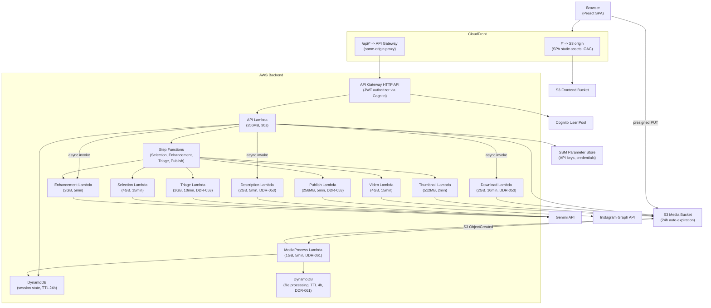
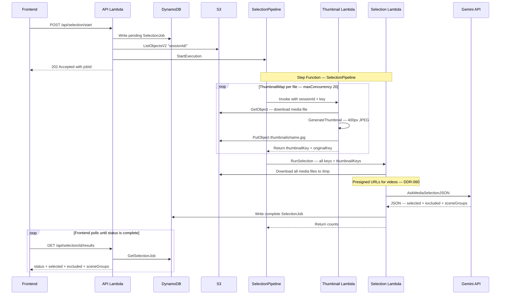
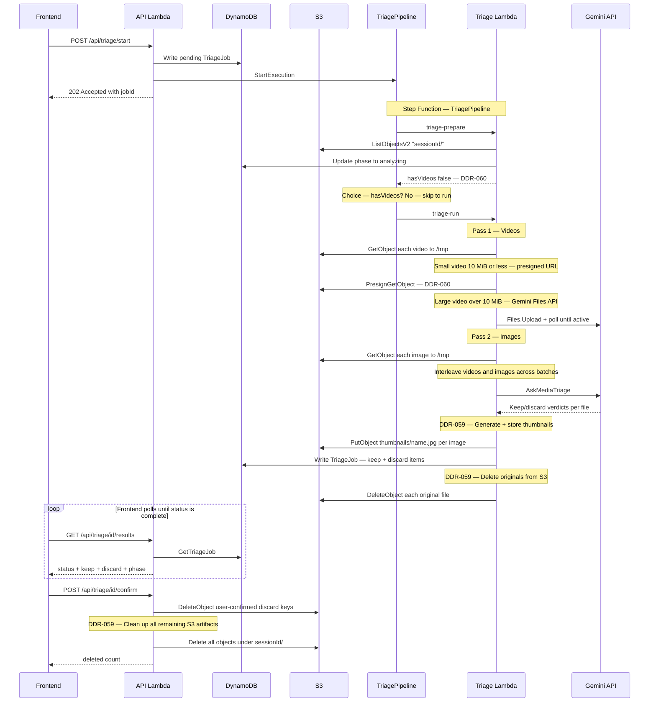
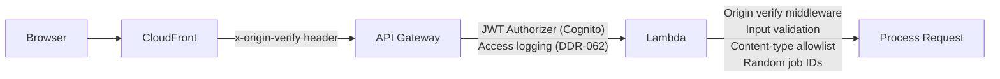

# Architecture Overview

## System Overview

The Gemini Media CLI is a collection of Go tools for analyzing, selecting, and enhancing photos and videos using Google's Gemini API. It runs in two modes: **local** (CLI + embedded web server) and **cloud** (AWS Lambda + S3 + CloudFront).

```mermaid
graph TD
    subgraph binaries [Binaries]
        MediaSelect["media-select\n(CLI)"]
        MediaTriage["media-triage\n(CLI)"]
        MediaWeb["media-web\n(local web server)"]
        MediaLambda["media-lambda\n(AWS Lambda)"]
        TriageLambdaBin["triage-lambda\n(DDR-053)"]
        MediaProcessBin["media-process-lambda\n(DDR-061)"]
        DescLambdaBin["description-lambda\n(DDR-053)"]
        DownloadLambdaBin["download-lambda\n(DDR-053)"]
        PublishLambdaBin["publish-lambda\n(DDR-053)"]
        WebhookLambda["webhook-lambda\n(AWS Lambda)"]
        OAuthLambda["oauth-lambda\n(AWS Lambda)"]
    end

    subgraph internal [Shared Packages - internal/]
        Auth["auth\n(API key, Cognito)"]
        Chat["chat\n(Gemini API: selection,\ntriage, enhancement)"]
        FileHandler["filehandler\n(EXIF, thumbnails,\ncompression)"]
        LambdaBoot["lambdaboot\n(shared init, DDR-053)"]
        Logging["logging\n(zerolog)"]
        Assets["assets\n(prompts, reference photos)"]
        Store["store\n(DynamoDB sessions)"]
        Jobs["jobs\n(job routing)"]
        S3Util["s3util\n(S3 download, upload,\nthumbnail helpers)"]
        JobUtil["jobutil\n(error handling)"]
        Instagram["instagram\n(publishing client,\nOAuth token exchange)"]
        Webhook["webhook\n(Meta event handler)"]
    end

    subgraph frontend [Frontend]
        PreactSPA["Preact SPA\n(TypeScript + Vite)"]
    end

    MediaSelect --> Chat
    MediaSelect --> FileHandler
    MediaTriage --> Chat
    MediaTriage --> FileHandler
    MediaWeb --> Chat
    MediaWeb --> FileHandler
    MediaWeb --> PreactSPA
    MediaLambda --> Store
    MediaLambda --> Instagram
    TriageLambdaBin --> Chat
    TriageLambdaBin --> FileHandler
    TriageLambdaBin --> LambdaBoot
    TriageLambdaBin --> S3Util
    MediaProcessBin --> FileHandler
    MediaProcessBin --> LambdaBoot
    MediaProcessBin --> S3Util
    DescLambdaBin --> Chat
    DescLambdaBin --> LambdaBoot
    DownloadLambdaBin --> LambdaBoot
    DownloadLambdaBin --> S3Util
    PublishLambdaBin --> Instagram
    PublishLambdaBin --> LambdaBoot
    WebhookLambda --> Webhook
    OAuthLambda --> Instagram
    PreactSPA --> MediaWeb
    PreactSPA --> MediaLambda
```



## Tech Stack

| Component | Technology |
|-----------|-----------|
| Language | Go 1.24 |
| AI Model | Gemini 3 (Flash for triage, 3.1 Pro for selection/enhancement) |
| SDK | `google.golang.org/genai` |
| CLI Framework | `github.com/spf13/cobra` |
| Logging | `github.com/rs/zerolog` |
| Web Frontend | Preact 10 + Vite 6 + TypeScript |
| AWS SDK | `aws-sdk-go-v2` (S3, SSM, DynamoDB) |
| Lambda Adapter | `aws-lambda-go-api-proxy` (HTTP API v2 to `http.ServeMux`) |

## Local Architecture

In local mode, `media-web` serves the Preact SPA via `go:embed` and exposes a JSON REST API on `localhost:8080`. Media files are read from the local filesystem.


The JSON-only API design enabled the Phase 2 migration to Lambda without changing the frontend. See [DDR-022](./design-decisions/DDR-022-web-ui-preact-spa.md).

## Cloud Architecture

In cloud mode, the Preact SPA is hosted on CloudFront (S3 origin), the Go backend runs as Lambda functions behind API Gateway, and media files are stored in S3 with presigned URL uploads.



### Key Design Decisions

1. **Presigned URL uploads** — browser uploads directly to S3, bypassing Lambda's 6MB payload limit
2. **CloudFront API proxy** — `/api/*` requests are proxied to API Gateway, making all requests same-origin (no CORS needed)
3. **Download-to-tmp** — Lambda downloads S3 objects to `/tmp` so existing `filehandler` and `chat` packages work unchanged
4. **Separate binary** — `media-lambda` is purpose-built for Lambda; different I/O patterns than `media-web`
5. **Build-time mode detection** — `VITE_CLOUD_MODE` flag switches between local file picker and S3 drag-and-drop uploader

See [DDR-026](./design-decisions/DDR-026-phase2-lambda-s3-deployment.md) for the full cloud migration decision.

## Multi-Lambda Architecture

Processing steps that exceed API Gateway's 30-second timeout use AWS Step Functions for parallel orchestration:

| Lambda | Purpose | Container | Memory | Timeout | Credentials |
|--------|---------|-----------|--------|---------|-------------|
| API | HTTP API, DynamoDB, presigned URLs, dispatch async work | Light | 256 MB | 30s | Gemini + Instagram |
| Triage | Triage pipeline: prepare (list S3), run (presigned URLs, AI triage, thumbnails, cleanup) (DDR-053, DDR-059, DDR-060) | Light | 2 GB | 10 min | Gemini |
| Description | Caption generation + feedback (DDR-053) | Light | 2 GB | 5 min | Gemini |
| Download | ZIP bundle creation (DDR-053) | Light | 2 GB | 10 min | None |
| Publish | Publish pipeline: containers, poll Instagram, finalize (DDR-053) | Light | 256 MB | 5 min | Instagram |
| Thumbnail | Per-file thumbnail generation | Heavy (ffmpeg) | 512 MB | 2 min | Gemini |
| Selection | Gemini AI media selection | Heavy (ffmpeg) | 4 GB | 15 min | Gemini |
| Enhancement | Per-photo Gemini image editing + feedback (DDR-053) | Light | 2 GB | 5 min | Gemini |
| Video | Per-video ffmpeg enhancement | Heavy (ffmpeg) | 4 GB | 15 min | Gemini |
| Webhook | Meta webhook verification + event handling | Light | 128 MB | 10s | None |
| OAuth | Instagram OAuth token exchange | Light | 128 MB | 10s | Instagram |
| RAG Ingest | SQS → Bedrock Titan → Aurora pgvector (DDR-066) | Light | 1 GB | 2 min | Bedrock |
| RAG Query | Vector + DynamoDB profile retrieval for triage/selection/caption | Light | 512 MB | 30s | Aurora Data API, DynamoDB |
| RAG Status | Aurora cluster state + start if stopped | Light | 256 MB | 30s | RDS |
| RAG Auto-Stop | Scheduled: stop Aurora if idle > 2h | Light | 256 MB | 30s | RDS, DynamoDB |
| RAG Profile | Weekly: compute preference profile, write DynamoDB | Light | 2 GB | 5 min | Aurora Data API, SSM, Gemini |

"Light" images (~55 MB) contain only the Go binary. "Heavy" images (~175 MB) include ffmpeg. Both share base Docker layers for efficient ECR storage. Webhook and OAuth Lambdas are deployed in a separate WebhookStack with their own CloudFront distribution (DDR-044, DDR-048). See [DDR-035](./design-decisions/DDR-035-multi-lambda-deployment.md), [DDR-053](./design-decisions/DDR-053-granular-lambda-split.md), and [docker-images.md](./docker-images.md).

### Async Job Dispatch (DDR-050, DDR-052)

The API Lambda dispatches all long-running work asynchronously — **no background goroutines**. This avoids Lambda's execution freeze problem where goroutines stall between invocations.

| Workflow | Dispatch | Processor |
|----------|----------|-----------|
| Selection | Step Functions `StartExecution` | Thumbnail → Selection pipeline |
| Enhancement | Step Functions `StartExecution` | Enhancement + Video pipeline |
| Triage | Step Functions `StartExecution` (DDR-052) | Triage Lambda (prepare → run; DDR-060 bypasses Gemini polling) |
| Publish | Step Functions `StartExecution` (DDR-052) | Publish Lambda (containers → poll Instagram → finalize) |
| Description | `lambda:Invoke` (async) | Description Lambda (DDR-053) |
| Download | `lambda:Invoke` (async) | Download Lambda (DDR-053) |
| Enhancement feedback | `lambda:Invoke` (async) | Enhancement Lambda (DDR-053) |

Each domain has a dedicated Lambda with its own CloudWatch log group for easier troubleshooting (DDR-053). Download Lambda has no AI or Instagram dependencies (smallest binary). Publish Lambda needs only Instagram credentials.

All job state is stored in DynamoDB. The API Lambda writes a pending job, dispatches processing, and polls DynamoDB for results.

### Processing Lambda Entrypoints

The API Lambda uses HTTP request/response via API Gateway. Domain-specific Lambdas are either invoked by Step Functions or asynchronously by the API Lambda. Each handler follows `func(ctx, Event) (Result, error)`:

| Lambda | Entrypoint | Invocation | Input | Output |
|--------|-----------|------------|-------|--------|
| Triage | `cmd/triage-lambda` | Step Functions | `{type, sessionId, jobId, model}` | returns JSON + writes DynamoDB |
| Description | `cmd/description-lambda` | Async invoke | `{type, sessionId, jobId, keys[], ...}` | writes to DynamoDB |
| Download | `cmd/download-lambda` | Async invoke | `{type, sessionId, jobId, keys[]}` | writes to DynamoDB |
| Publish | `cmd/publish-lambda` | Step Functions | `{type, sessionId, jobId, groupId, ...}` | returns JSON + writes DynamoDB |
| Thumbnail | `cmd/thumbnail-lambda` | Step Functions | `{sessionId, key}` | `{thumbnailKey, originalKey}` |
| Selection | `cmd/selection-lambda` | Step Functions | `{sessionId, jobId, tripContext, model, mediaKeys[], thumbnailKeys[]}` | `{jobId, selectedCount, excludedCount, sceneGroupCount}` |
| Enhancement | `cmd/enhance-lambda` | Step Functions + async | `{sessionId, jobId, key, itemIndex}` or `{type: "enhancement-feedback", ...}` | `{enhancedKey, phase}` |
| Video | `cmd/video-lambda` | Step Functions | `{sessionId, jobId, key, itemIndex}` | `{enhancedKey, phase}` |

Thumbnail and Enhancement Lambdas process exactly one file per invocation (Step Functions Map state fans out). Selection Lambda processes all files in one batch. Enhancement Lambda also handles feedback via async invocation (DDR-053). See [DDR-043](./design-decisions/DDR-043-step-functions-lambda-entrypoints.md).

Each processing Lambda is split into multiple files (e.g. `main.go`, `types.go`, `handler.go`); triage, enhance, description, and media-process also have domain-specific modules (gemini, feedback, media_items, processor, store_helpers).

### Media Selection Pipeline

The Selection Pipeline orchestrates thumbnail generation and AI-powered media ranking. The API Lambda dispatches work to the `SelectionPipeline` Step Function, which fans out thumbnail generation in parallel before running a single Gemini selection pass.



**Key details:**

- **ThumbnailMap** runs up to 20 Thumbnail Lambda invocations in parallel. Each downloads one file from S3, generates a 400px JPEG thumbnail (ffmpeg for videos, pure Go for images), and uploads it to `{sessionId}/thumbnails/{baseName}.jpg`. Retries: 2 attempts with exponential backoff. Soft failures do not halt the pipeline.
- **RunSelection** receives the full input plus the collected `thumbnailKeys[]` from the Map state. It downloads all media, generates S3 presigned URLs for videos so Gemini can fetch them directly (DDR-060), and calls `AskMediaSelectionJSON` for structured ranking. Results (selected, excluded, scene groups) are written to DynamoDB as a complete `SelectionJob`.
- **Pipeline timeout**: 30 minutes. Selection Lambda timeout: 15 minutes (4 GB memory, Heavy container with ffmpeg).

### Media Triage Pipeline

The Triage Pipeline evaluates uploaded media and categorizes each file as keep or discard. After DDR-060, the Gemini polling step is bypassed — videos use S3 presigned URLs or inline Gemini Files API uploads instead.



**Key details:**

- **triage-prepare** lists S3 objects and counts supported files for progress tracking. It always returns `HasVideos: false` (DDR-060) so the Step Function skips the `triage-check-gemini` polling loop. The Gemini polling path still exists in the state machine for potential future use.
- **triage-run** uses a two-pass download strategy to conserve `/tmp` disk space:
  - **Pass 1 (videos)**: Download, extract metadata. Small videos (<=10 MiB) get an S3 presigned URL; large videos (>10 MiB) are uploaded to the Gemini Files API with inline polling. Local files are deleted after URL/upload.
  - **Pass 2 (images)**: Download and keep on disk for thumbnail generation.
  - Videos and images are interleaved before batching to prevent all-video batches that would overwhelm the Gemini API.
- **DDR-059 cleanup**: After `AskMediaTriage` succeeds, thumbnails are generated from `/tmp` files and uploaded to S3. Original files are then deleted immediately. The 1-day S3 lifecycle policy acts as a safety net for abandoned sessions.
- **Confirm cleanup**: When the user confirms triage results, the API Lambda deletes the user-selected discard keys, then cleans up all remaining S3 artifacts (thumbnails, compressed videos) in a background goroutine.
- **Pipeline timeout**: 30 minutes. Triage Lambda timeout: 10 minutes (2 GB memory, Light container).

## Gemini Context Caching (DDR-065)

The application uses Gemini's Context Caching API to avoid re-sending identical system prompts and media context across multiple `GenerateContent` calls within a session. This reduces both input token costs and latency.

| Pipeline | Cache Key | What's Cached | Benefit |
|----------|-----------|---------------|---------|
| Selection | `{sessionID}:selection` | System prompt + all media parts (thumbnails, video refs) | Avoids re-sending media when selection is retried or followed by description |
| Triage | `{sessionID}:triage` | System prompt + batch media parts | Reuses context across triage batches of 20 files |
| Description | `{sessionID}:description` | System prompt + media parts for the post group | Reuses context across multi-turn feedback rounds |

**Lifecycle:** Caches are created on-demand with a 1-hour TTL (sufficient for a session) and deleted when the Lambda invocation completes. If cache creation fails (e.g., token count below the 4096 minimum), the system falls back to inline context with no user-visible impact.

**Observability:** New metrics `GeminiCacheHit`, `GeminiCacheMiss`, and `GeminiCachedTokens` track cache effectiveness.

## RAG Decision Memory (DDR-066)

The system persists user decisions (triage, selection, overrides, captions, publish) and injects a **preference profile** or **caption style examples** into AI prompts so recommendations improve with use. See [rag-decision-memory.md](./rag-decision-memory.md).

- **Feedback pipeline:** Triage, Selection, Description, Publish, and API Lambdas emit `ContentFeedback` events to the default EventBridge bus; a rule routes to SQS. The RAG Ingest Lambda embeds each event with Bedrock Titan (1024d) and upserts into Aurora PostgreSQL (pgvector, five tables by event type).
- **Retrieval:** Before building prompts, Triage/Selection/Description Lambdas invoke the RAG Query Lambda with `queryType` (triage, selection, caption). The Lambda returns pre-computed profile text from DynamoDB; when Aurora is available it can also run vector similarity search. If Aurora is stopped, the Lambda serves the last profile from DynamoDB (stale cache fallback).
- **Profile batch:** A weekly scheduled Lambda queries Aurora, computes rule-based stats, calls Gemini to generate a natural-language preference profile, and writes it (and caption style examples) to DynamoDB.
- **Aurora lifecycle:** Auto-Stop Lambda runs every 15 min and stops the cluster if last activity &gt; 2h. The frontend calls `GET /api/rag/status` on load; RAG Status Lambda starts the cluster if stopped. All RAG behavior is best-effort and does not block main flows.

## Observability

Version identity and structured logging across every layer. See [DDR-062](./design-decisions/DDR-062-observability-and-version-tracking.md).

| Signal | Where | What |
|--------|-------|------|
| Commit hash | Health endpoint, cold-start log, `X-App-Version` header | Exact deployed version |
| Build time | Health endpoint, cold-start log | When the binary was built |
| Client version | `X-Client-Version` request header, error messages | Frontend/backend skew detection |
| Route table | Cold-start log (INFO) | All registered HTTP routes |
| Unmatched routes | Catch-all handler (WARN) | Distinguishes mux-404 from handler-404 |
| API Gateway access | CloudWatch log group | Auth rejections, throttling, routing errors before Lambda |
| SPA routing | CloudFront Function (viewer-request) | Rewrites non-file paths to index.html without masking API errors |

Version identity is injected at build time via `-ldflags -X` (backend) and `VITE_COMMIT_HASH` (frontend). Every cold-start log includes `commitHash` and `buildTime`. Every API response includes `X-App-Version`. Error messages include both frontend and backend versions.

## Security Architecture

Defense-in-depth with multiple layers. See [DDR-028](./design-decisions/DDR-028-security-hardening.md).



| Layer | Control |
|-------|---------|
| CloudFront | Origin-verify header, response security headers (CSP, HSTS), SPA routing via CloudFront Function (DDR-062) |
| API Gateway | JWT authorizer (Cognito), throttling (100 burst / 50 rps), CORS, access logging (DDR-062) |
| Lambda | Origin-verify middleware, input validation, content-type allowlist, safe error messages, version headers (DDR-062) |
| S3 | CORS locked to CloudFront domain, OAC (no public access) |

## Frontend Components

| Component | Mode | Purpose |
|-----------|------|---------|
| `LandingPage.tsx` | Cloud | Workflow chooser (triage vs selection) |
| `FileUploader.tsx` | Cloud (triage) | Drag-and-drop S3 upload |
| `MediaUploader.tsx` | Cloud (selection) | File System Access API pickers + trip context |
| `SelectionView.tsx` | Cloud (selection) | AI selection results + review with override |
| `EnhancementView.tsx` | Cloud (selection) | Photo enhancement with feedback loop |
| `PostGrouper.tsx` | Cloud (selection) | Drag-and-drop media grouping into posts |
| `DownloadView.tsx` | Cloud (selection) | ZIP bundle download |
| `DescriptionEditor.tsx` | Cloud (selection) | AI caption generation with feedback |
| `PublishView.tsx` | Cloud (selection) | Instagram publishing |
| `FileBrowser.tsx` | Local | Native OS file picker via Go backend |
| `TriageView.tsx` | Both | Triage results and deletion interface |
| `LoginForm.tsx` | Cloud | Cognito authentication UI |

**Shared utilities:** `hooks/usePolling.ts`, `hooks/useElapsedTimer.ts`, `components/shared/ActionBar.tsx`, `utils/format.ts`, `utils/fileSystem.ts`, `utils/statusBadge.ts`. Views use these instead of duplicated implementations.

**Extracted subcomponents:** `SelectedCard`, `enhancement/EnhancementCard`, `enhancement/SideBySideComparison`, `media-uploader/thumbnailGenerator`, `post-grouper/` (state, useGroupOperations, MediaThumbnail, GroupIcon), `download/BundleCard`, `download/GroupCard`, `TriageMediaCard`.

## CI/CD

Two independent CodePipelines triggered by GitHub pushes to main:

| Pipeline | Flow |
|----------|------|
| Frontend | Preact build -> S3 sync -> CloudFront invalidation |
| Backend | 11 parallel Docker builds (8 light + 3 heavy) with BuildKit caching -> 11 Lambda function updates |

ECR repositories are owned by a dedicated RegistryStack (DDR-046), deployed before any application stack. This breaks the chicken-and-egg dependency where `DockerImageFunction` requires an image that the pipeline hasn't pushed yet. See [DDR-046](./design-decisions/DDR-046-centralized-registry-stack.md).

### Deploy Optimization (DDR-047)

CDK deployments use optimized flags via `cdk/Makefile`:

| Command | Purpose |
|---------|---------|
| `make deploy` | Full deploy: `--method=direct --concurrency 3` |
| `make deploy-backend` | Single-stack deploy: `--method=direct --exclusively` |
| `make deploy-dev` | Dev mode: `--hotswap --concurrency 3` |
| `make watch-backend` | Auto-deploy on CDK file changes |

Local Lambda code iteration bypasses CodePipeline entirely:

```
make push-api    # ~1-2 min: docker build -> ECR push -> Lambda update
```

Operations monitoring is split into two stacks for faster deploys:
- **OperationsAlertStack**: alarms, SNS, X-Ray (changes often, deploys in ~1-2 min)
- **OperationsMonitoringStack**: dashboard, metric filters, Firehose, Glue (changes rarely)

## Cost Tracking

All AWS resources across all 9 stacks are tagged with `Project = ai-social-media-helper` (DDR-049). This tag is applied at the CDK app level and automatically inherited by every resource. To view system costs:

1. Activate the `Project` tag in **AWS Billing** > **Cost Allocation Tags**
2. Filter by `Project = ai-social-media-helper` in **AWS Cost Explorer**

## Related Documents

- [media-triage.md](./media-triage.md) — Triage workflow
- [media-selection.md](./media-selection.md) — Selection workflow
- [image-processing.md](./image-processing.md) — Image technical details
- [video-processing.md](./video-processing.md) — Video technical details
- [authentication.md](./authentication.md) — Credential management and Cognito auth
- [docker-images.md](./docker-images.md) — Docker image strategy and ECR layer sharing
- [DDR-046](./design-decisions/DDR-046-centralized-registry-stack.md) — Centralized RegistryStack for ECR repositories
- [DDR-047](./design-decisions/DDR-047-cdk-deploy-optimization.md) — CDK deploy optimization
- [DDR-049](./design-decisions/DDR-049-aws-resource-tagging.md) — AWS resource tagging for cost tracking
- [DDR-050](./design-decisions/DDR-050-replace-goroutines-with-async-dispatch.md) — Replace goroutines with DynamoDB + Step Functions / async Lambda
- [DDR-052](./design-decisions/DDR-052-step-functions-polling-for-long-running-ops.md) — Step Functions polling for long-running operations (triage, publish)
- [DDR-053](./design-decisions/DDR-053-granular-lambda-split.md) — Granular Lambda split: Worker Lambda → 4 domain-specific Lambdas + shared bootstrap
- [DDR-059](./design-decisions/DDR-059-frugal-triage-s3-cleanup.md) — Frugal Triage — Early S3 Cleanup via Thumbnails
- [DDR-060](./design-decisions/DDR-060-s3-presigned-urls-for-gemini.md) — S3 Presigned URLs for Gemini Video Transfer
- [DDR-062](./design-decisions/DDR-062-observability-and-version-tracking.md) — Observability gaps and version tracking
- [DDR-065](./design-decisions/DDR-065-gemini-context-caching-and-batch-api.md) — Gemini Context Caching and Batch API Integration

---

**Last Updated**: 2026-02-19
