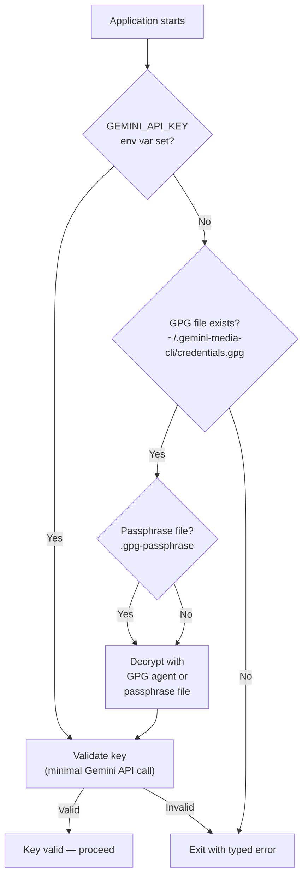
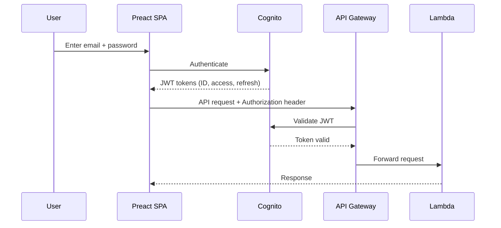

# Authentication & Key Storage

## Overview

The application uses different authentication mechanisms depending on the deployment mode:

- **Local mode** — Gemini API key via environment variable or GPG-encrypted file
- **Cloud mode** — Amazon Cognito User Pool for user authentication; Gemini API key loaded from SSM Parameter Store at Lambda cold start

## Credential Resolution (Local Mode)



**Priority order:**
1. `GEMINI_API_KEY` environment variable (highest — CI/CD compatible)
2. GPG-encrypted file at `~/.gemini-media-cli/credentials.gpg`

**Validation:** A minimal request ("hi") is sent to `gemini-3-flash-preview` at startup to verify the key is valid, not revoked, and has available quota. See [DDR-004](./design-decisions/DDR-004-startup-api-validation.md).

## GPG Credential Storage

Store and retrieve your API key using GPG encryption. See [DDR-003](./design-decisions/DDR-003-gpg-credential-storage.md).

**Setup:**
```bash
# Encrypt your API key (one-time)
echo "your-api-key-here" | gpg --encrypt --recipient your-email@example.com \
    -o ~/.gemini-media-cli/credentials.gpg

# Verify it works
gpg --decrypt ~/.gemini-media-cli/credentials.gpg 2>/dev/null
```

**Non-interactive decryption:** For CI/CD or development convenience, place your GPG passphrase in a `.gpg-passphrase` file in the project root (gitignored). The app uses `--pinentry-mode loopback --passphrase-file` for automatic decryption. See [DDR-003](./design-decisions/DDR-003-gpg-credential-storage.md).

**Cross-machine sync:** Copy `~/.gemini-media-cli/credentials.gpg` and import your GPG key (`gpg --import private.key`) on the new machine.

## Validation Error Handling

| Error Type | HTTP Codes | User Guidance |
|------------|------------|---------------|
| No Key | N/A | Set `GEMINI_API_KEY` or run `scripts/setup-gpg-credentials.sh` |
| Invalid Key | 400, 401, 403 | Check key at [Google AI Studio](https://aistudio.google.com/app/apikey) |
| Network Error | 500, 502, 503, 504 | Check internet connection |
| Quota Exceeded | 429 | Wait for reset or check usage limits |

See [DDR-005](./design-decisions/DDR-005-typed-validation-errors.md) for typed error handling design.

## Cloud Authentication (Cognito)

In cloud mode, user authentication uses Amazon Cognito User Pool with JWT tokens. See [DDR-028](./design-decisions/DDR-028-security-hardening.md).



**Key points:**
- Self-signup is disabled — users are provisioned by admin via AWS CLI
- API Gateway JWT authorizer validates tokens before forwarding to Lambda
- Frontend uses `amazon-cognito-identity-js` for authentication
- Tokens stored in browser memory, automatically refreshed
- Health endpoint (`/api/health`) is unauthenticated

**User provisioning:**
```bash
aws cognito-idp admin-create-user \
  --user-pool-id <pool-id> --username <email> \
  --user-attributes Name=email,Value=<email> Name=email_verified,Value=true

aws cognito-idp admin-set-user-password \
  --user-pool-id <pool-id> --username <email> \
  --password '<password>' --permanent
```

**Password policy:** Minimum 12 characters, requires uppercase + lowercase + digits + symbols. Token validity: 1 hour (ID/access), 7 days (refresh).

## Session Ownership (IDOR Prevention)

Every API session is bound to the authenticated Cognito user's `sub` claim. The API Lambda extracts the `sub` from the JWT authorizer context and:

1. **First access** — creates a `META` record in DynamoDB with `ownerSub` set to the caller's `sub`
2. **Subsequent access** — verifies the caller's `sub` matches the stored `ownerSub`

Legacy sessions (created before this check was added) have no `ownerSub` and are allowed access with a warning log.

## Origin-Verify Secret

CloudFront injects an `x-origin-verify` header with a cryptographically random secret (stored in AWS Secrets Manager). The API Lambda rejects all requests without a valid header — **fail-closed** (no bypass when secret is empty).

## SSM Parameter Security

Sensitive parameters are stored as **SecureString** type in SSM Parameter Store, encrypted with the default `aws/ssm` KMS key:

| Parameter | Type |
|-----------|------|
| `/ai-social-media/prod/gemini-api-key` | SecureString |
| `/ai-social-media/prod/instagram-app-secret` | SecureString |
| `/ai-social-media/prod/instagram-webhook-verify-token` | SecureString |
| `/ai-social-media/prod/instagram-access-token` | SecureString |
| `/ai-social-media/prod/instagram-user-id` | String (not secret) |

## OAuth CSRF Protection

The Instagram OAuth flow uses a `state` parameter for CSRF protection:

1. `GET /oauth/authorize` — generates a random state token, stores it in SSM, and redirects to Instagram
2. `GET /oauth/callback?code=...&state=...` — verifies the state matches the stored value (single-use)

Always use `/oauth/authorize` to initiate the OAuth flow instead of constructing the URL manually.

## Security Best Practices

- Never commit API keys to Git — `.gpg-passphrase` and credential files are gitignored
- Use environment variables for CI/CD pipelines
- Regenerate keys immediately if compromise is suspected
- File permissions: `chmod 600 ~/.gemini-media-cli/credentials.gpg`
- GPG passphrase file must have `0600` permissions — the app rejects files with group/other access

## Related DDRs

- [DDR-003](./design-decisions/DDR-003-gpg-credential-storage.md) — GPG credential storage
- [DDR-004](./design-decisions/DDR-004-startup-api-validation.md) — Startup API key validation
- [DDR-005](./design-decisions/DDR-005-typed-validation-errors.md) — Typed validation errors
- [DDR-025](./design-decisions/DDR-025-ssm-parameter-store-secrets.md) — SSM Parameter Store for runtime secrets
- [DDR-028](./design-decisions/DDR-028-security-hardening.md) — Security hardening

---

**Last Updated**: 2026-02-15
