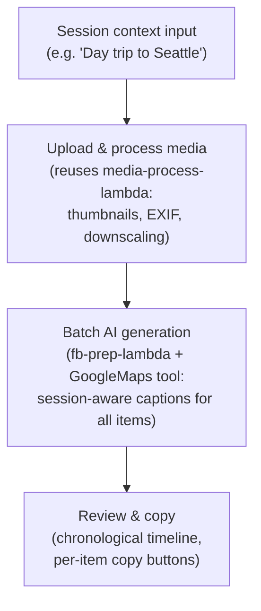
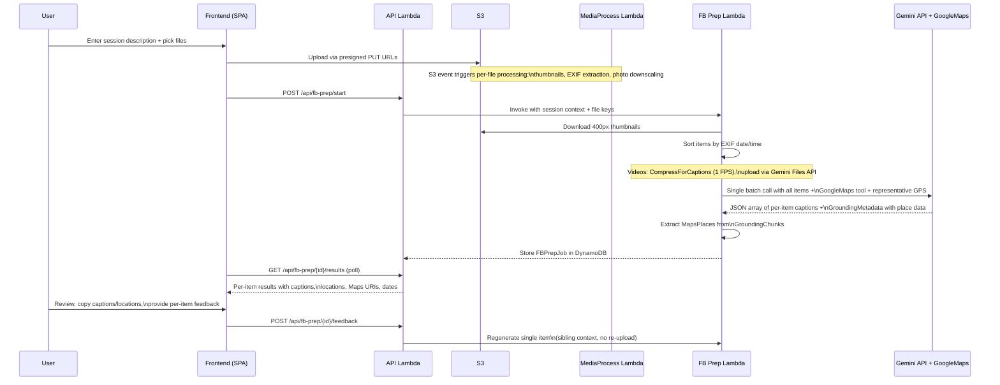

# Facebook Prep

AI-powered per-item caption and location generation for manual Facebook uploads.

## What is Facebook Prep?

Facebook Prep is a session-aware workflow that generates per-item metadata for manually uploading photos and videos to Facebook. Unlike Instagram's carousel approach (one caption per post group), Facebook requires individual captions for each upload. Photos in a session are narrative-related — "a day in Seattle" is a story, not a bag of independent images — so captions must be unique yet collectively coherent.

For each item, Facebook Prep generates:
- **Caption**: A natural, personal-tone Facebook caption (no hashtags, no Instagram hooks)
- **Location**: A verified place name from Google Maps grounding with a Maps link
- **Date/Time**: Extracted from EXIF metadata (not AI-generated) for reference during upload

Available as a cloud-hosted service.

## Workflow

## How It Works

## Session-Aware Captions

The system prompt instructs Gemini to:

1. **Understand the session as a story** — identify the narrative arc (arrival, exploration, highlights, departure)
2. **Create varied captions** — each with a distinct opening, angle, or observation; avoid starting multiple captions the same way
3. **Reference unique visual details** — each caption mentions something specific to that photo that distinguishes it from neighbors
4. **Cross-pollinate location context** — infer locations for GPS-less items from temporal neighbors
5. **Vary emotional register** — mix wonder, humor, reflection, and observation; not every photo needs "Amazing views!"
6. **Acknowledge temporal progression** — where natural, reference time of day or sequence

## Google Maps Grounding

Location suggestions use Google Maps grounding via the Gemini API's `GoogleMaps` tool:

1. The app computes a representative GPS centroid from all GPS-bearing items in the session
2. This coordinate is passed via `ToolConfig.RetrievalConfig.LatLng` to anchor Maps results to the region
3. Gemini uses Google Maps internally to verify and suggest place names
4. The response includes `GroundingMetadata.GroundingChunks[].Maps` with structured place data (`PlaceID`, `Title`, `URI`)
5. The frontend shows the suggested location name with a "View on Google Maps" link

Per Google's service usage requirements, Google Maps attribution uses Roboto font with accessible contrast.

## Per-Item Feedback

When the user provides feedback on a single caption (e.g., "make it shorter", "mention the coffee"):

1. Only the target item's thumbnail + metadata is re-sent to Gemini
2. Existing captions for all sibling items are included as text context (no thumbnails)
3. Gemini regenerates just that one caption, aware of siblings to avoid duplication
4. Only that item's result is updated in DynamoDB

This is more efficient than regenerating the entire batch and preserves the user's accepted captions.

## Large Sessions (>20 items)

For sessions exceeding 20 items:

1. **Phase 1 — Session summary**: All thumbnails + metadata sent in one call for a ~200-word narrative summary
2. **Phase 2 — Batched captions**: Items split into batches of 20, each receiving the Phase 1 summary + full metadata for all items, generating captions only for the current batch

This ensures cross-batch narrative coherence.

## Video Handling

Videos are compressed at caption-grade quality (more aggressive than the standard DDR-018 profile):

| Parameter | Standard (DDR-018) | Caption-grade (FB Prep) |
|-----------|-------------------|------------------------|
| Max FPS | 5 | 1 |
| CRF | 35 | 40 |
| Audio | Opus 24kbps mono | Stripped |
| Resolution | 768px | 768px |

At 1 FPS, a 30-second video costs ~2,100 tokens at `MediaResolutionLow` — comparable to a few photo thumbnails.

### Economy Mode: Location Pre-Enrichment (DDR-085)

The Vertex AI batch prediction API does not support the GoogleMaps grounding tool in
JSONL input. To preserve Maps-accurate location tags in economy mode, the fb-prep lambda
runs a fast real-time pre-enrichment step before submitting the batch JSONL:

1. **Pre-enrichment call** — A single real-time Gemini call is made with GPS coordinates
   as plain text and the GoogleMaps tool enabled. The model reverse-geocodes each
   coordinate and returns a `{index, location_tag}` JSON array.
2. **Context injection** — The verified place names are added to the batch metadata
   context as a `## Maps-verified locations` section. The batch model reads these names
   directly and uses them for the `location_tag` field.
3. **Silent fallback** — If the pre-enrichment call fails, the batch job proceeds with
   raw GPS coordinates only (pre-DDR-085 behavior). This is logged and metricked.

**Comparison metrics**: When the batch job completes, `handleCollectBatch` compares each
item's `location_tag` from the batch model against the pre-enrichment value and emits
`LocationTagAgreementRate` to CloudWatch. This allows evaluating whether the
pre-enrichment call is worth keeping long-term.

## Related DDRs

- [DDR-078](./design-decisions/DDR-078-facebook-prep-workflow.md) — Facebook Prep Workflow design decisions
- [DDR-077](./design-decisions/DDR-077-cost-aware-vertex-ai-migration.md) — Cost-Aware Vertex AI Migration
- [DDR-036](./design-decisions/DDR-036-ai-post-description.md) — AI Post Description Generation (Instagram approach)
- [DDR-071](./design-decisions/DDR-071-photo-downscaling-for-gemini.md) — Photo Downscaling and Media Resolution Strategy
- [DDR-061](./design-decisions/DDR-061-s3-event-driven-per-file-processing.md) — S3 Event-Driven Per-File Processing

---

**Last Updated**: 2026-03-01
