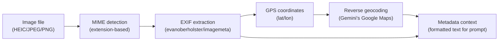
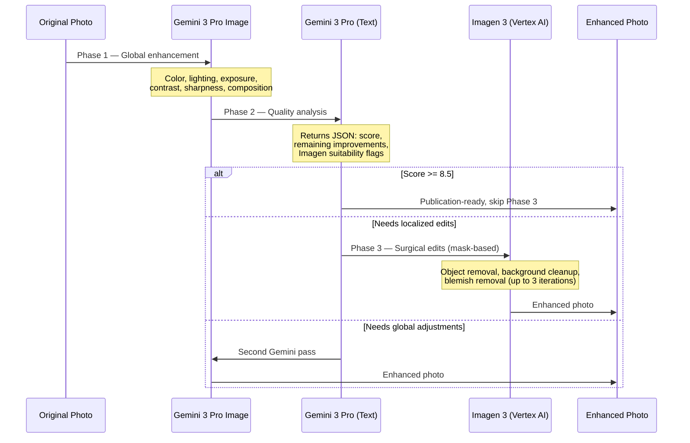

# Image Processing

Technical documentation for image handling: format support, metadata extraction, thumbnail generation, and AI enhancement.

## Supported Formats

| Extension | MIME Type | Common Source |
|-----------|-----------|---------------|
| `.jpg`, `.jpeg` | `image/jpeg` | Most cameras, web |
| `.png` | `image/png` | Screenshots, graphics |
| `.gif` | `image/gif` | Animated images |
| `.webp` | `image/webp` | Modern web format |
| `.heic` | `image/heic` | iPhone (iOS 11+) |
| `.heif` | `image/heif` | HEIC variant |

HEIC/HEIF support uses a pure Go library (`evanoberholster/imagemeta`) — no external tools needed. See [DDR-010](./design-decisions/DDR-010-heic-format-support.md).

## Metadata Extraction

EXIF metadata is extracted locally using a Go library and passed as text alongside the image to Gemini. The AI cannot reliably parse binary EXIF headers, so preprocessing is required.

**Extracted fields:**
- GPS coordinates (latitude, longitude) with Google Maps link
- Date/time taken (timezone-aware)
- Camera make and model
- Formatted as structured text appended to the Gemini prompt

**Reverse geocoding** uses Gemini's native Google Maps integration — no separate API key needed. The AI resolves GPS coordinates to place names, street addresses, and landmarks. See [DDR-009](./design-decisions/DDR-009-gemini-reverse-geocoding.md).

**Error handling:** If EXIF extraction fails (corrupted metadata, unsupported format), the pipeline continues without metadata. A warning is logged but processing is not blocked.

## Thumbnail Generation

Thumbnails are generated for two purposes:

| Context | Size | Purpose |
|---------|------|---------|
| Selection UI | 400px | Display in web UI grids; cached in S3 |
| Gemini API | 1024px | Sent to Gemini for AI analysis (in-memory) |

In cloud mode, 400px thumbnails are pre-generated during the selection step and stored in S3 at `{sessionId}/thumbnails/{filename}.jpg`. All downstream steps (review, enhancement, grouping) serve these cached thumbnails directly. See [DDR-014](./design-decisions/DDR-014-thumbnail-selection-strategy.md).

## Enhancement Pipeline

The photo enhancement pipeline applies AI models in three automated phases to bring photos to professional quality. See [DDR-031](./design-decisions/DDR-031-multi-step-photo-enhancement.md) for the full design decision.

**User feedback loop:** After automatic enhancement, users can request changes ("make the sky more blue", "remove the trash can"). Feedback is sent to Gemini first; if the result is insufficient, it falls back to Imagen 3 for surgical edits. Multi-turn conversation history is preserved.

**API endpoints:**

| Method | Path | Action |
|--------|------|--------|
| `POST` | `/api/enhance/start` | Start enhancement for selected photos |
| `GET` | `/api/enhance/{id}/results` | Poll enhancement progress and results |
| `POST` | `/api/enhance/{id}/feedback` | Re-enhance a photo with user feedback |

**Infrastructure:** Gemini 3 Pro Image uses the existing Gemini API key. Imagen 3 requires Vertex AI (GCP project, service account). If Vertex AI is not configured, Phase 3 is skipped gracefully.

## Related DDRs

- [DDR-007](./design-decisions/DDR-007-hybrid-exif-prompt.md) — Hybrid EXIF prompt strategy
- [DDR-008](./design-decisions/DDR-008-pure-go-exif-library.md) — Pure Go EXIF library selection
- [DDR-009](./design-decisions/DDR-009-gemini-reverse-geocoding.md) — Gemini native reverse geocoding
- [DDR-010](./design-decisions/DDR-010-heic-format-support.md) — HEIC/HEIF format support
- [DDR-013](./design-decisions/DDR-013-unified-metadata-architecture.md) — Unified metadata architecture
- [DDR-014](./design-decisions/DDR-014-thumbnail-selection-strategy.md) — Thumbnail selection strategy
- [DDR-031](./design-decisions/DDR-031-multi-step-photo-enhancement.md) — Multi-step photo enhancement pipeline

---

**Last Updated**: 2026-02-09
