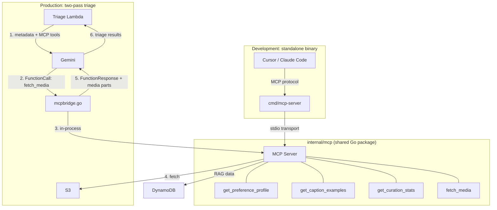

# MCP Server for RAG Tools

Model Context Protocol (MCP) server that exposes RAG data and media fetching as tools for Gemini and IDE development. **Design decision:** [DDR-070](./design-decisions/DDR-070-mcp-server-rag-tools.md).

## Overview

The MCP server is a single Go package (`internal/mcp/`) that serves as the unified source of truth for all RAG tool definitions. It runs in two modes:

1. **Embedded in Lambda** — in-process via the Gemini bridge, zero network overhead
2. **Standalone binary** — over stdio for IDE integration (Cursor, Claude Code)

The same tools, same code, same behavior in both modes.

## Architecture



## Tools

### `get_preference_profile`

Returns the user's media curation preference profile from DynamoDB. Describes patterns for keeping/discarding photos and videos based on past decisions.

**Parameters:**
- `query_type` (string, enum: `triage`, `selection`) — type of profile to retrieve

**Returns:** Profile text describing user preferences, or "No preference profile available yet." if none exists.

### `get_caption_examples`

Returns examples of the user's past social media captions from DynamoDB. Used to match writing style, hashtag preferences, and tone.

**Parameters:** None

**Returns:** Numbered list of past captions, or "No past caption examples available yet."

### `get_curation_stats`

Returns aggregate curation statistics: keep rate, override rate, common reasons for keeping/discarding, media type breakdown.

**Parameters:** None

**Returns:** JSON object with statistics, or "No curation statistics available yet."

### `fetch_media` (Lambda only)

Fetches actual media content (photos/videos) for specific items by index. Only available when the MCP server is embedded in a Lambda with media configuration.

**Parameters:**
- `media_indices` (array of integers) — 1-based indices of media items to fetch

**Returns:** Image thumbnails (as inline image content) and video references (as presigned URLs or Gemini Files API URIs).

**Smart video routing:**

| Video Size | Method | Latency |
|-----------|--------|---------|
| ≤ 20 MiB | S3 presigned URL in `FileData.FileURI` | Gemini fetches directly |
| > 20 MiB | Upload to Gemini Files API | Upload + processing, then instant |

## Gemini Bridge

The bridge (`internal/chat/mcpbridge.go`) auto-converts MCP tool definitions to Gemini `FunctionDeclaration`s and handles the multimodal tool call loop:

1. MCP `TextContent` → Gemini text in `FunctionResponse`
2. MCP `ImageContent` → Gemini `InlineData` (thumbnails)
3. Video `_media_ref` JSON → Gemini `FileData` (presigned URL or Files API URI)

All parts are bundled into a single `Content` turn per tool call round.

## Two-Pass Triage Flow

When `RAG_MODE=mcp`, triage switches from the single-pass (all media upfront) approach to a model-driven two-pass flow:

| Aspect | Single-pass (preload) | Two-pass (MCP) |
|--------|----------------------|----------------|
| **First pass** | All media sent to Gemini | Metadata only + MCP tools |
| **RAG context** | Always preloaded, always billed | On-demand via `get_preference_profile` |
| **Media fetch** | Lambda downloads all upfront | Model calls `fetch_media` for items it needs |
| **Obvious items** | Still sent (wasted tokens) | Triaged from metadata alone |
| **Gemini API calls** | 1 per batch | 2-3 per batch (metadata + tool rounds) |

**Guardrails:**
- If the model returns results without ever calling `fetch_media`, the system falls back to the single-pass approach
- Maximum 3 tool call rounds to prevent runaway
- Same `triageBatchSize = 20` limit applies

## IDE Development Setup

### Prerequisites

- Go 1.26+
- AWS credentials configured (for DynamoDB access)
- The `rag-preference-profiles` DynamoDB table must exist and be accessible

### Cursor MCP Configuration

The workspace includes a `.cursor/mcp.json` that configures the standalone MCP server:

```json
{
  "mcpServers": {
    "ai-social-media-rag": {
      "command": "go",
      "args": ["run", "./cmd/mcp-server"],
      "cwd": "/path/to/ai-social-media-helper",
      "env": {
        "RAG_PROFILES_TABLE_NAME": "rag-preference-profiles"
      }
    }
  }
}
```

Update `cwd` to your local path. AWS credentials are picked up from your default profile or environment variables.

### Usage from IDE

Once configured, you can query the MCP server directly from Cursor or Claude Code:

- "What are the user's triage preferences?" → calls `get_preference_profile`
- "Show me past caption examples" → calls `get_caption_examples`
- "What are the curation statistics?" → calls `get_curation_stats`

This is invaluable for debugging triage behavior, iterating on prompts, and understanding the RAG data without deploying to AWS.

## Lambda Integration

### Environment variable

Add `RAG_MODE` to the triage Lambda environment:

```typescript
fn.addEnvironment('RAG_MODE', 'preload'); // flip to 'mcp' to enable
```

### IAM requirements

When `RAG_MODE=mcp`, the triage Lambda reads DynamoDB directly (bypassing the RAG Query Lambda):

```typescript
this.ragProfilesTable.grantReadData(triageLambda);
triageLambda.addEnvironment('RAG_PROFILES_TABLE_NAME', this.ragProfilesTable.tableName);
```

## Cost Impact

| Component | Preload mode | MCP mode |
|-----------|-------------|----------|
| **RAG Query Lambda** | 1 invoke per triage batch | 0 (bypassed) |
| **Gemini API calls** | 1 per batch | 2-3 per batch |
| **Input tokens** | All media + full profile | Metadata + fetched media + on-demand profile |
| **Video tokens** | All videos processed | Obvious items skipped (sub-0.5s, metadata-only) |

Net cost is approximately neutral for most sessions. The savings from skipping unnecessary video tokens and RAG Query Lambda invokes offset the extra Gemini API calls.

## Related Documents

- [DDR-070: MCP Server for RAG Tools](./design-decisions/DDR-070-mcp-server-rag-tools.md) — architecture decision
- [DDR-069: BatchExecuteStatement](./design-decisions/DDR-069-batch-execute-statement-ingest.md) — ingest throughput
- [RAG Decision Memory](./rag-decision-memory.md) — RAG system overview
- [Media Triage](./media-triage.md) — triage workflow

---

**Last Updated**: 2026-02-28
