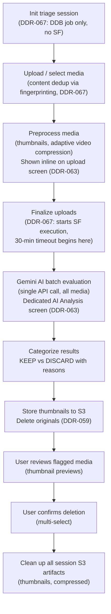
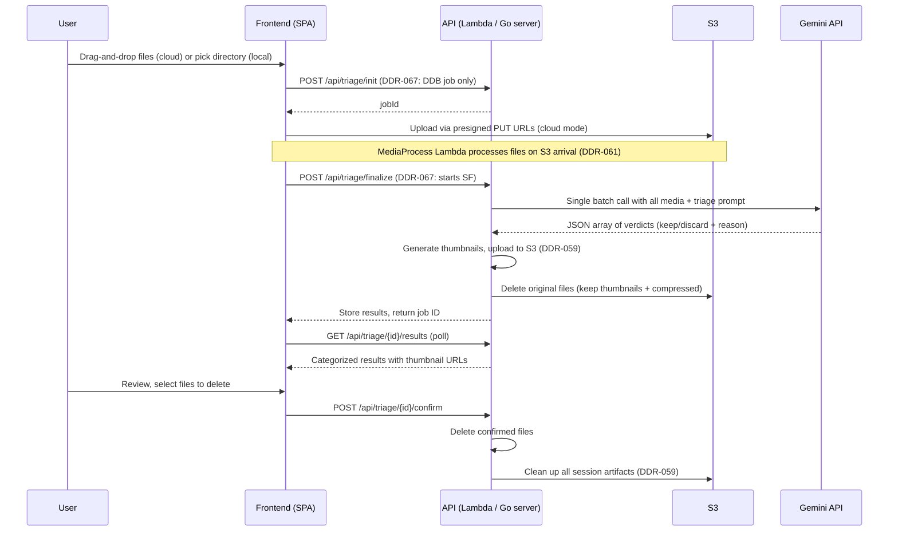

# Media Triage

AI-powered identification and removal of unsaveable photos and videos.

## What is Media Triage?

Media triage uses Google's Gemini API to evaluate a batch of photos and videos and categorize each as **keep** or **discard**. It identifies media that is too dark, too blurry, accidental (pocket shots, floor, finger over lens), or has no discernible subject. The goal is to help users quickly clean up large media libraries after trips or events.

Available as a CLI tool (`media-triage`), a local web UI (`media-web`), and a cloud-hosted service (`media-lambda`).

## Workflow

### Cloud UI Screens (DDR-063)

The cloud triage flow splits into two distinct UI screens:

1. **Upload & Process Media** (`triage-upload`): Users drag-and-drop files. Each file progresses through: Uploading to S3 → Server Processing (thumbnail/compress) → Ready. Files are grouped by status with thumbnails shown inline as they become available. The screen remains active until all per-file processing completes.
2. **AI Analysis** (`processing`): Once all files are processed, the user transitions to a dedicated Gemini analysis screen showing only the three AI sub-phases: uploading to Gemini, video processing, and analyzing.

## How It Works

## Triage Criteria

The AI is instructed to be **generous** — if a normal person can understand the subject and light editing could make it decent, keep it.

**Discard if:**
- Too dark or blurry to recover any meaningful content
- Accidental shot (pocket photo, floor, finger over lens)
- No discernible subject or meaning
- Video shorter than 2 seconds (pre-filtered locally before AI evaluation)

## Local vs Cloud

| Aspect | CLI (`media-triage`) | Local Web (`media-web`) | Cloud (`media-lambda`) |
|--------|---------------------|------------------------|----------------------|
| Input | `--directory` flag | File browser in UI | Drag-and-drop upload to S3 |
| Processing | Local Go binary | Local Go binary | AWS Lambda |
| Media access | Local filesystem | Local filesystem | S3 presigned URLs |
| Video support | Full (ffmpeg required) | Full (ffmpeg required) | Full — videos via S3 presigned URLs (DDR-060) |
| Authentication | API key (env var / GPG) | API key (env var / GPG) | Cognito JWT |

## S3 Storage Optimization (DDR-059)

After triage-run completes, original files are no longer needed — the review UI only uses thumbnails. To minimize S3 storage costs:

1. **During triage-run:** Image thumbnails are generated from temp files on disk and uploaded to `{sessionId}/thumbnails/{baseName}.webp`. Original files are then deleted from S3 (excluding `thumbnails/` and `compressed/` prefixes).
2. **After triage confirm:** All remaining session artifacts (thumbnails, compressed videos) are cleaned up via a best-effort goroutine.
3. **Safety net:** The 1-day S3 lifecycle policy handles abandoned sessions where the user never confirms.

For a typical 36-file session (~500 MB originals), this reduces S3 storage-hours from ~12,000 MB-hours to ~26 MB-hours.

## Related DDRs

- [DDR-021](./design-decisions/DDR-021-media-triage-command.md) — Media Triage Command design
- [DDR-022](./design-decisions/DDR-022-web-ui-preact-spa.md) — Web UI with Preact SPA
- [DDR-026](./design-decisions/DDR-026-phase2-lambda-s3-deployment.md) — Phase 2 Lambda + S3 deployment
- [DDR-042](./design-decisions/DDR-042-landing-page-workflow-switcher.md) — Landing page workflow switcher
- [DDR-059](./design-decisions/DDR-059-frugal-triage-s3-cleanup.md) — Frugal Triage — Early S3 Cleanup via Thumbnails
- [DDR-060](./design-decisions/DDR-060-s3-presigned-urls-for-gemini.md) — S3 Presigned URLs for Gemini Video Transfer
- [DDR-061](./design-decisions/DDR-061-s3-event-driven-per-file-processing.md) — S3 Event-Driven Per-File Processing
- [DDR-063](./design-decisions/DDR-063-split-processing-ui-screens.md) — Split File Processing and Gemini Request into Separate UI Screens

---

**Last Updated**: 2026-02-18
