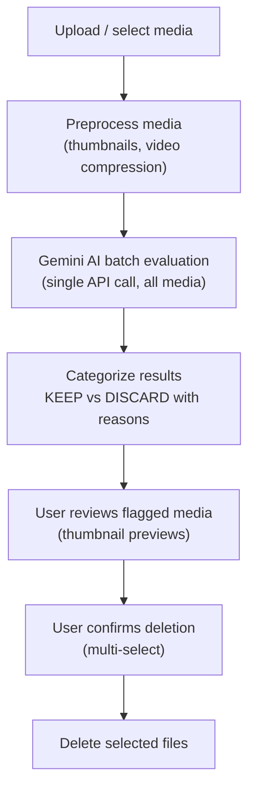
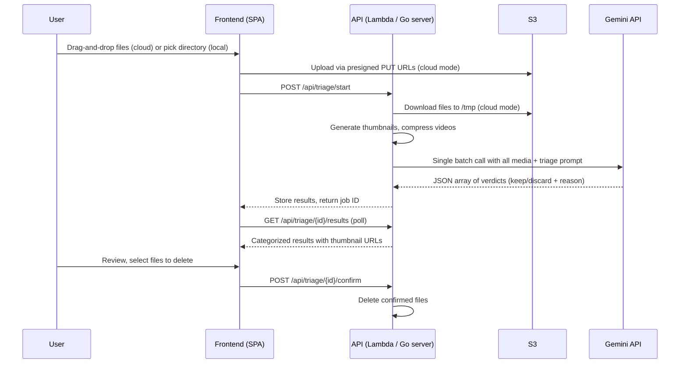

# Media Triage

AI-powered identification and removal of unsaveable photos and videos.

## What is Media Triage?

Media triage uses Google's Gemini API to evaluate a batch of photos and videos and categorize each as **keep** or **discard**. It identifies media that is too dark, too blurry, accidental (pocket shots, floor, finger over lens), or has no discernible subject. The goal is to help users quickly clean up large media libraries after trips or events.

Available as a CLI tool (`media-triage`), a local web UI (`media-web`), and a cloud-hosted service (`media-lambda`).

## Workflow

## How It Works

## Triage Criteria

The AI is instructed to be **generous** — if a normal person can understand the subject and light editing could make it decent, keep it.

**Discard if:**
- Too dark or blurry to recover any meaningful content
- Accidental shot (pocket photo, floor, finger over lens)
- No discernible subject or meaning
- Video shorter than 2 seconds (pre-filtered locally before AI evaluation)

## Local vs Cloud

| Aspect | CLI (`media-triage`) | Local Web (`media-web`) | Cloud (`media-lambda`) |
|--------|---------------------|------------------------|----------------------|
| Input | `--directory` flag | File browser in UI | Drag-and-drop upload to S3 |
| Processing | Local Go binary | Local Go binary | AWS Lambda |
| Media access | Local filesystem | Local filesystem | S3 presigned URLs |
| Video support | Full (ffmpeg required) | Full (ffmpeg required) | Images only (no ffmpeg in Lambda yet) |
| Authentication | API key (env var / GPG) | API key (env var / GPG) | Cognito JWT |

## Related DDRs

- [DDR-021](./design-decisions/DDR-021-media-triage-command.md) — Media Triage Command design
- [DDR-022](./design-decisions/DDR-022-web-ui-preact-spa.md) — Web UI with Preact SPA
- [DDR-026](./design-decisions/DDR-026-phase2-lambda-s3-deployment.md) — Phase 2 Lambda + S3 deployment
- [DDR-042](./design-decisions/DDR-042-landing-page-workflow-switcher.md) — Landing page workflow switcher

---

**Last Updated**: 2026-02-09
