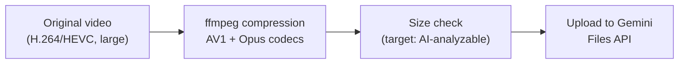
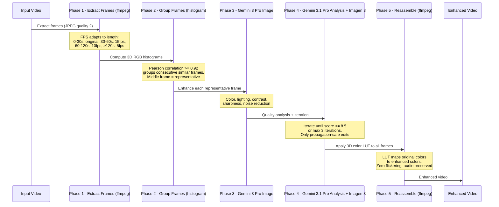

# Video Processing

Technical documentation for video handling: format support, metadata extraction, compression, and AI enhancement.

## Supported Formats

| Extension | MIME Type | Common Source |
|-----------|-----------|---------------|
| `.mp4` | `video/mp4` | Most cameras, phones |
| `.mov` | `video/quicktime` | iPhone, macOS |
| `.avi` | `video/x-msvideo` | Older cameras |
| `.webm` | `video/webm` | Web-optimized |
| `.mkv` | `video/x-matroska` | High-quality archival |

## Metadata Extraction

Video metadata is extracted using `ffprobe` (part of the FFmpeg suite):

- Duration, resolution, frame rate
- Video codec (H.264, HEVC, AV1, etc.)
- Audio codec and channels
- Creation timestamp

See [DDR-011](./design-decisions/DDR-011-video-metadata-and-upload.md) for the video metadata design.

## Compression Pipeline

Videos are compressed before upload to Gemini using AV1 video + Opus audio codecs. A 1GB video typically compresses to ~2MB while preserving AI-analyzable quality. See [DDR-018](./design-decisions/DDR-018-video-compression-gemini3.md).

**Note:** In cloud mode (triage and selection Lambdas), videos can bypass compression entirely via S3 presigned URLs — Gemini fetches the raw video directly from S3. This eliminates the need for ffmpeg in the triage Lambda's "light" container. See [DDR-060](./design-decisions/DDR-060-s3-presigned-urls-for-gemini.md).

**Compression settings:**
- Video: AV1 via `libsvtav1` (requires FFmpeg with SVT-AV1 support)
- Audio: Opus via `libopus`
- Target: Preserve visual content for AI analysis, not human viewing

**Dependencies:** FFmpeg must be installed with `libsvtav1` and `libopus` support.
- macOS: `brew install ffmpeg`
- Linux: `apt install ffmpeg`

## Enhancement Pipeline

The video enhancement pipeline decomposes video into frames, enhances representative frames with AI, then reassembles with consistent color grading. See [DDR-032](./design-decisions/DDR-032-multi-step-video-enhancement.md).

**Key design choices:**
- **Frame grouping** reduces AI calls from ~900 (30fps x 30s) to ~15-30 groups per 30-second video
- **Color LUT propagation** guarantees zero flickering between consecutive frames and identical color grading within each scene
- **Propagation safety** — only improvements flagged `safeForPropagation: true` are applied (prevents removing moving objects that would look inconsistent across frames)
- **Audio preservation** — original audio track is preserved exactly, no re-encoding

**Lambda constraints:** Videos over 2 minutes may exceed Lambda's 15-minute timeout. FFmpeg is bundled in the "heavy" container image (~175 MB). See [DDR-027](./design-decisions/DDR-027-container-image-lambda-local-commands.md).

## Related DDRs

- [DDR-011](./design-decisions/DDR-011-video-metadata-and-upload.md) — Video metadata extraction and upload
- [DDR-018](./design-decisions/DDR-018-video-compression-gemini3.md) — Video compression for Gemini
- [DDR-027](./design-decisions/DDR-027-container-image-lambda-local-commands.md) — Container image Lambda (ffmpeg bundling)
- [DDR-032](./design-decisions/DDR-032-multi-step-video-enhancement.md) — Multi-step video enhancement pipeline
- [DDR-060](./design-decisions/DDR-060-s3-presigned-urls-for-gemini.md) — S3 presigned URLs for Gemini video transfer

---

**Last Updated**: 2026-02-14
